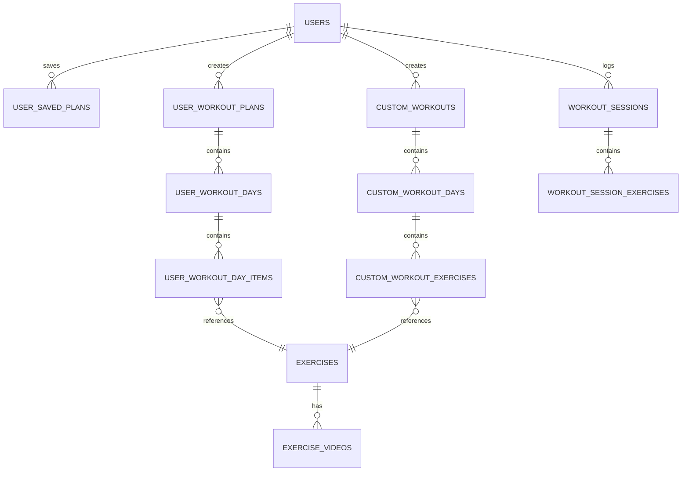
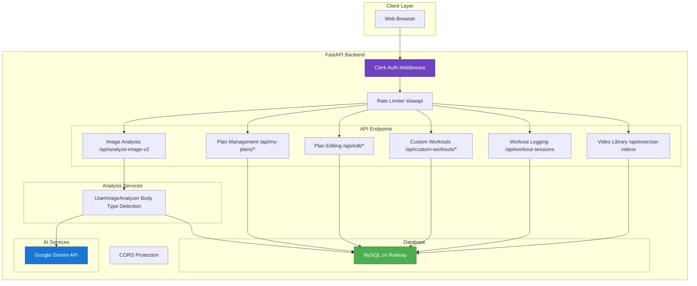
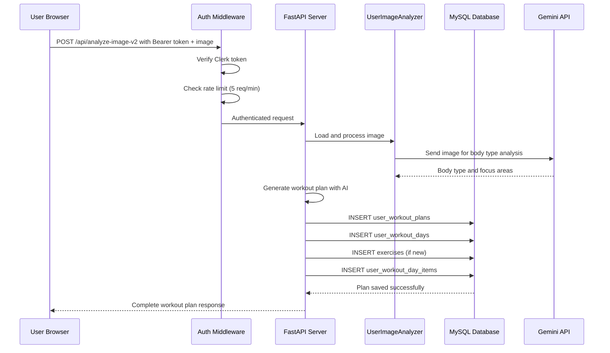

# Database Architecture & Service Connections

## Entity Relationship Diagram



## Service Connection Architecture



## Data Flow: Image Analysis to Workout Plan



## Database Tables (Verified from Live Database)

The SculpFit database contains these 15 tables:

### exercises
Exercise library with basic information.

| Column | Type | Notes |
|--------|------|-------|
| id | INT (PK) | Auto-increment |
| name | VARCHAR(100) | Exercise name |
| muscle_group | VARCHAR(50) | chest, back, shoulders, etc. |
| difficulty | ENUM | beginner, intermediate, advanced |
| created_at | TIMESTAMP | Auto-generated |

---

### user_workout_plans
AI-generated workout plans from image analysis.

| Column | Type | Notes |
|--------|------|-------|
| id | INT (PK) | Auto-increment |
| clerk_user_id | VARCHAR(255) | User ID from Clerk |
| name | VARCHAR(255) | Plan name |
| days_per_week | INT | 3, 4, 5 days |
| primary_focus | VARCHAR(255) | Body focus area |
| created_at | TIMESTAMP | Auto-generated |

---

### user_workout_days
Days within AI-generated user plans.

| Column | Type | Notes |
|--------|------|-------|
| id | INT (PK) | Auto-increment |
| user_plan_id | INT (FK) | References user_workout_plans |
| day_number | INT | 1-7 |
| title | VARCHAR(255) | "Chest Day", etc. |
| created_at | TIMESTAMP | Auto-generated |

---

### user_workout_day_items
Exercises within user workout days.

| Column | Type | Notes |
|--------|------|-------|
| id | INT (PK) | Auto-increment |
| user_day_id | INT (FK) | References user_workout_days |
| exercise_id | INT (FK) | References exercises |
| sets | INT | Sets to perform |
| reps | VARCHAR(50) | "6-12" |
| rest_seconds | INT | Rest time |
| position | INT | Order in workout |
| created_at | TIMESTAMP | Auto-generated |

---

### custom_workouts
User-created custom workouts.

| Column | Type | Notes |
|--------|------|-------|
| id | INT (PK) | Auto-increment |
| clerk_user_id | VARCHAR(255) | User ID |
| name | VARCHAR(255) | Workout name |
| days_per_week | INT | 3, 4, 5 days |
| created_at | TIMESTAMP | Auto-generated |

---

### custom_workout_days
Days in custom workouts.

| Column | Type | Notes |
|--------|------|-------|
| id | INT (PK) | Auto-increment |
| custom_workout_id | INT (FK) | References custom_workouts |
| day_number | INT | 1-7 |
| title | VARCHAR(255) | Day name |
| created_at | TIMESTAMP | Auto-generated |

---

### custom_workout_exercises
Exercises in custom workout days.

| Column | Type | Notes |
|--------|------|-------|
| id | INT (PK) | Auto-increment |
| custom_day_id | INT (FK) | References custom_workout_days |
| exercise_id | INT (FK) | References exercises |
| exercise_name | VARCHAR(255) | Exercise name |
| sets | INT | Sets to perform |
| reps | VARCHAR(50) | Reps per set |
| rest_seconds | INT | Rest time |
| position | INT | Order in workout |
| created_at | TIMESTAMP | Auto-generated |

---

### user_saved_plans
When users save pre-built plans (currently unused in app).

| Column | Type | Notes |
|--------|------|-------|
| id | INT (PK) | Auto-increment |
| clerk_user_id | VARCHAR(255) | User ID from Clerk |
| plan_id | INT (FK) | References workout_plans |
| body_type | VARCHAR(100) | Body type |
| focus1, focus2, focus3 | VARCHAR(100) | Focus areas |
| saved_at | TIMESTAMP | When saved |
| created_at | TIMESTAMP | Auto-generated |

---

### workout_sessions
Logged workout sessions by users.

| Column | Type | Notes |
|--------|------|-------|
| id | INT (PK) | Auto-increment |
| clerk_user_id | VARCHAR(255) | User ID |
| workout_plan_id | INT | Plan ID |
| workout_plan_type | VARCHAR(50) | "ai_generated" or "custom" |
| workout_name | VARCHAR(255) | Session name |
| day_number | INT | Which day of plan |
| session_date | DATE | When workout occurred |
| created_at | TIMESTAMP | Auto-generated |

---

### workout_session_exercises
Individual exercises logged in sessions.

| Column | Type | Notes |
|--------|------|-------|
| id | INT (PK) | Auto-increment |
| session_id | INT (FK) | References workout_sessions |
| exercise_id | INT (FK) | References exercises |
| exercise_name | VARCHAR(255) | Exercise name |
| sets_completed | INT | Sets actually done |
| reps_completed | VARCHAR(50) | Reps actually done |
| weight_used | DECIMAL(5,2) | Weight lifted |
| notes | TEXT | User notes |
| created_at | TIMESTAMP | Auto-generated |

---

### workout_progress
User progress tracking and statistics.

| Column | Type | Notes |
|--------|------|-------|
| id | INT (PK) | Auto-increment |
| clerk_user_id | VARCHAR(255) | User ID |
| exercise_id | INT (FK) | References exercises |
| exercise_name | VARCHAR(255) | Exercise name |
| personal_record_weight | DECIMAL(5,2) | Best weight |
| personal_record_reps | INT | Best reps |
| personal_record_date | DATE | When PR achieved |
| total_sessions | INT | Times this exercise done |
| updated_at | TIMESTAMP | Auto-updated |

---

### exercise_videos
Video library for exercise demonstrations.

| Column | Type | Notes |
|--------|------|-------|
| id | INT (PK) | Auto-increment |
| exercise_id | INT (FK) | References exercises |
| video_url | VARCHAR(255) | YouTube/video URL |
| thumbnail_url | VARCHAR(255) | Thumbnail image |
| title | VARCHAR(255) | Video title |
| description | TEXT | Video description |
| difficulty_level | ENUM | beginner, intermediate, advanced |
| created_at | TIMESTAMP | Auto-generated |

---

### workout_plans
Pre-built workout templates (referenced but not actively used).

| Column | Type | Notes |
|--------|------|-------|
| id | INT (PK) | Auto-increment |
| name | VARCHAR(255) | Plan name |
| description | TEXT | Plan overview |
| body_type | ENUM | ectomorph, mesomorph, endomorph |
| primary_focus | VARCHAR(100) | chest, back, legs, etc. |
| difficulty | ENUM | beginner, intermediate, advanced |
| days_per_week | INT | 3, 4, 5, 6 days |
| created_at | TIMESTAMP | Auto-generated |

---

### plan_exercises
Exercises linked to pre-built plans (referenced but not actively used).

| Column | Type | Notes |
|--------|------|-------|
| id | INT (PK) | Auto-increment |
| plan_id | INT (FK) | References workout_plans |
| day_number | INT | Which day of plan |
| exercise_id | INT (FK) | References exercises |
| position | INT | Order in day |
| sets | INT | Number of sets |
| reps | VARCHAR(50) | Rep range |
| rest_seconds | INT | Rest between sets |
| notes | VARCHAR(255) | Optional notes |
| created_at | TIMESTAMP | Auto-generated |

---

### exercise_muscle_groups
Junction table for exercises with multiple muscle groups.

| Column | Type | Notes |
|--------|------|-------|
| id | INT (PK) | Auto-increment |
| exercise_id | INT (FK) | References exercises |
| muscle_group | VARCHAR(50) | Muscle group name |
| is_primary | BOOLEAN | Primary or secondary muscle |
| created_at | TIMESTAMP | Auto-generated |

## Key Data Relationships

1. **AI-Generated Plans Flow:**
   ```
   user_workout_plans → user_workout_days → user_workout_day_items → exercises
   ```

2. **Custom Workouts Flow:**
   ```
   custom_workouts → custom_workout_days → custom_workout_exercises → exercises
   ```

3. **Workout Logging Flow:**
   ```
   workout_sessions → workout_session_exercises → exercises
   ```

4. **Video Library Flow:**
   ```
   exercises → exercise_videos
   ```

## Active vs Inactive Components

### ✅ Actively Used
- All table operations shown above
- user_workout_* tables (AI-generated plans)
- custom_workout_* tables (user-created workouts)
- workout_session_* tables (logging)
- exercise_videos table (video library)
- exercises table (exercise catalog)

### ⚠️ Present but Unused
- workout_plans table (pre-built templates not implemented in UI)
- plan_exercises table (pre-built templates not implemented in UI)
- user_saved_plans table (save functionality not active)

### ⚠️ Code Files Present but Not Called
- pushup_analyzer.py (exists but not imported in main.py)
- squat_analyzer.py (exists but not imported in main.py)
- shoulder_press_analyzer.py (exists but not imported in main.py)