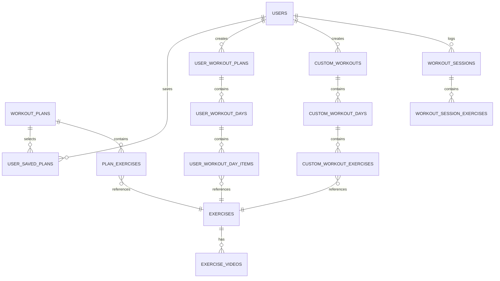
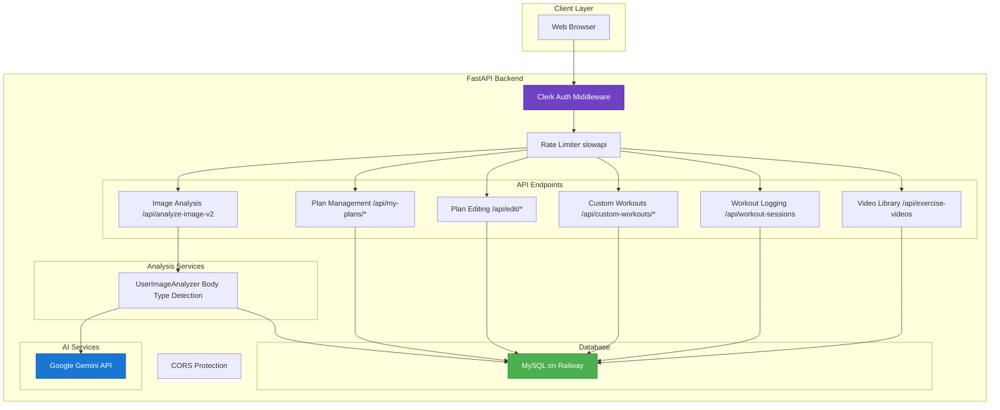
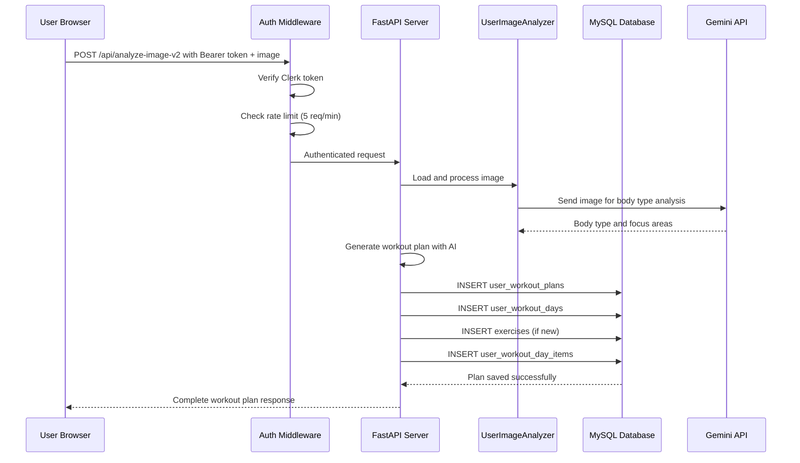

# Database Architecture & Service Connections

## Entity Relationship Diagram



## Service Connection Architecture



## Data Flow: Image Analysis to Workout Plan



## Database Tables (From Live Railway Database)

The SculpFit database contains **14 tables** (as of January 2026):

### exercises
Exercise library with basic information.

| Column | Type | Notes |
|--------|------|-------|
| id | INT (PK) | Auto-increment |
| name | VARCHAR(100) | Exercise name |
| muscle_group | VARCHAR(100) | chest, back, shoulders, legs, arms, core, etc. |
| difficulty | ENUM | beginner, intermediate, advanced |
| created_at | TIMESTAMP | Auto-generated |

---

### user_workout_plans
Editable plans created from AI analysis or cloned from pre-built plans.

| Column | Type | Notes |
|--------|------|-------|
| id | INT (PK) | Auto-increment |
| clerk_user_id | VARCHAR(255) | User ID from Clerk |
| source_plan_id | INT | References workout_plans (if cloned) or NULL (if AI-generated) |
| name | VARCHAR(255) | Plan name |
| days_per_week | INT | 3-7 days |
| primary_focus | VARCHAR(255) | Body focus area (chest, back, etc.) |
| created_at | TIMESTAMP | Auto-generated |
| updated_at | TIMESTAMP | Auto-updated on changes |

---

### user_workout_days
Days within user workout plans.

| Column | Type | Notes |
|--------|------|-------|
| id | INT (PK) | Auto-increment |
| user_plan_id | INT (FK) | References user_workout_plans |
| day_number | INT | 1-7 |
| title | VARCHAR(255) | "Chest Day", etc. |
| created_at | TIMESTAMP | Auto-generated |

---

### user_workout_day_items
Exercises within user workout days.

| Column | Type | Notes |
|--------|------|-------|
| id | INT (PK) | Auto-increment |
| user_day_id | INT (FK) | References user_workout_days |
| exercise_id | INT (FK) | References exercises |
| sets | INT | Sets to perform |
| reps | VARCHAR(50) | Reps per set (e.g., "6-12") |
| rest_seconds | INT | Rest time between sets |
| position | INT | Order in workout day |
| notes | VARCHAR(255) | Optional notes |
| created_at | TIMESTAMP | Auto-generated |

---

### custom_workouts
User-created custom workouts.

| Column | Type | Notes |
|--------|------|-------|
| id | INT (PK) | Auto-increment |
| clerk_user_id | VARCHAR(255) | User ID |
| name | VARCHAR(255) | Workout name |
| description | TEXT | Workout description |
| days_per_week | INT | 3-7 days |
| difficulty | ENUM | beginner, intermediate, advanced |
| created_at | TIMESTAMP | Auto-generated |
| updated_at | TIMESTAMP | Auto-updated on changes |

---

### custom_workout_days
Days in custom workouts.

| Column | Type | Notes |
|--------|------|-------|
| id | INT (PK) | Auto-increment |
| custom_workout_id | INT (FK) | References custom_workouts |
| day_number | INT | 1-7 |
| title | VARCHAR(255) | Day name (e.g., "Chest Day") |
| created_at | TIMESTAMP | Auto-generated |

---

### custom_workout_exercises
Exercises in custom workout days.

| Column | Type | Notes |
|--------|------|-------|
| id | INT (PK) | Auto-increment |
| custom_day_id | INT (FK) | References custom_workout_days |
| exercise_id | INT (FK) | References exercises |
| exercise_name | VARCHAR(255) | Exercise name |
| sets | INT | Sets to perform |
| reps | VARCHAR(50) | Reps per set |
| rest_seconds | INT | Rest time between sets |
| notes | VARCHAR(255) | Optional notes |
| position | INT | Order in workout day |
| created_at | TIMESTAMP | Auto-generated |

---

### workout_plans
Pre-built workout templates that users can browse and select.

| Column | Type | Notes |
|--------|------|-------|
| id | INT (PK) | Auto-increment |
| name | VARCHAR(255) | Plan name |
| description | TEXT | Plan description |
| body_type | ENUM | ectomorph, mesomorph, endomorph |
| primary_focus | VARCHAR(100) | Main focus area (chest, back, legs, etc.) |
| focus | VARCHAR(100) | Secondary focus area |
| difficulty | ENUM | beginner, intermediate, advanced |
| days_per_week | INT | 3-7 days |
| created_at | TIMESTAMP | Auto-generated |

---

### plan_exercises
Exercises in pre-built workout plans.

| Column | Type | Notes |
|--------|------|-------|
| id | INT (PK) | Auto-increment |
| plan_id | INT (FK) | References workout_plans |
| day_number | INT | Which day (1-7) |
| exercise_id | INT (FK) | References exercises |
| position | INT | Order in day (1st, 2nd, 3rd exercise) |
| sets | INT | Number of sets |
| reps | VARCHAR(50) | Rep range (e.g., "6-12") |
| rest_seconds | INT | Rest between sets |
| notes | VARCHAR(255) | Optional notes |
| created_at | TIMESTAMP | Auto-generated |

---

### workout_sessions
Logged workout sessions by users.

| Column | Type | Notes |
|--------|------|-------|
| id | INT (PK) | Auto-increment |
| clerk_user_id | VARCHAR(255) | User ID |
| workout_plan_id | INT | Plan ID |
| workout_plan_type | ENUM | custom, ai, saved |
| workout_name | VARCHAR(255) | Session name |
| day_number | INT | Which day of plan |
| session_date | DATE | When workout occurred |
| completed_at | TIMESTAMP | When session completed |
| duration_minutes | INT | Total workout duration |
| notes | TEXT | Session notes |
| rating | INT | User's difficulty rating (1-10) |
| created_at | TIMESTAMP | Auto-generated |

---

### workout_session_exercises
Individual exercises logged in sessions.

| Column | Type | Notes |
|--------|------|-------|
| id | INT (PK) | Auto-increment |
| session_id | INT (FK) | References workout_sessions |
| exercise_id | INT (FK) | References exercises |
| exercise_name | VARCHAR(255) | Exercise name |
| planned_sets | INT | Sets that were planned |
| planned_reps | VARCHAR(50) | Reps that were planned |
| planned_rest_seconds | INT | Rest time planned |
| completed_sets | INT | Sets actually completed |
| completed_reps | VARCHAR(50) | Reps actually completed |
| weight_used | DECIMAL(8,2) | Weight lifted |
| rpe | INT | Rate of Perceived Exertion (1-10) |
| notes | TEXT | Exercise-specific notes |
| position | INT | Order in session |
| completed_at | TIMESTAMP | When exercise completed |
| created_at | TIMESTAMP | Auto-generated |

---

### workout_progress
User progress tracking and statistics.

| Column | Type | Notes |
|--------|------|-------|
| id | INT (PK) | Auto-increment |
| clerk_user_id | VARCHAR(255) | User ID |
| exercise_id | INT (FK) | References exercises |
| exercise_name | VARCHAR(255) | Exercise name |
| personal_record_weight | DECIMAL(8,2) | Best weight lifted |
| personal_record_reps | INT | Best reps at max weight |
| personal_record_date | DATE | When PR was achieved |
| total_times_completed | INT | Total times this exercise done |
| last_completed_date | DATE | Last workout with this exercise |
| average_rpe | DECIMAL(3,1) | Average effort rating |
| created_at | TIMESTAMP | Auto-generated |
| updated_at | TIMESTAMP | Auto-updated |

---

### exercise_videos
Video library for exercise demonstrations.

| Column | Type | Notes |
|--------|------|-------|
| id | INT (PK) | Auto-increment |
| exercise_id | INT (FK) | References exercises |
| title | VARCHAR(255) | Video title |
| video_url | VARCHAR(500) | YouTube/video URL |
| thumbnail_url | VARCHAR(500) | Thumbnail image URL |
| duration_seconds | INT | Video length in seconds |
| description | TEXT | Video description |
| common_mistakes | TEXT | Common form mistakes |
| form_tips | TEXT | Form tips and cues |
| difficulty_level | ENUM | beginner, intermediate, advanced |
| views | INT | Number of views |
| created_at | TIMESTAMP | Auto-generated |
| updated_at | TIMESTAMP | Auto-updated |

---

### migrations
Database migration tracking.

| Column | Type | Notes |
|--------|------|-------|
| id | INT (PK) | Auto-increment |
| name | VARCHAR(255) | Migration name/filename |
| applied_at | TIMESTAMP | When migration was applied |

### custom_workout_days
Days in custom workouts.

| Column | Type | Notes |
|--------|------|-------|
| id | INT (PK) | Auto-increment |
| custom_workout_id | INT (FK) | References custom_workouts |
| day_number | INT | 1-7 |
| title | VARCHAR(255) | Day name |
| created_at | TIMESTAMP | Auto-generated |

---

### custom_workout_exercises
Exercises in custom workout days.

| Column | Type | Notes |
|--------|------|-------|
| id | INT (PK) | Auto-increment |
| custom_day_id | INT (FK) | References custom_workout_days |
| exercise_id | INT (FK) | References exercises |
| exercise_name | VARCHAR(255) | Exercise name |
| sets | INT | Sets to perform |
| reps | VARCHAR(50) | Reps per set |
| rest_seconds | INT | Rest time |
| position | INT | Order in workout |
| created_at | TIMESTAMP | Auto-generated |

---

### workout_sessions
Logged workout sessions by users.

| Column | Type | Notes |
|--------|------|-------|
| id | INT (PK) | Auto-increment |
| clerk_user_id | VARCHAR(255) | User ID |
| workout_plan_id | INT | Plan ID |
| workout_plan_type | VARCHAR(50) | "ai_generated" or "custom" |
| workout_name | VARCHAR(255) | Session name |
| day_number | INT | Which day of plan |
| session_date | DATE | When workout occurred |
| created_at | TIMESTAMP | Auto-generated |

---

### workout_session_exercises
Individual exercises logged in sessions.

| Column | Type | Notes |
|--------|------|-------|
| id | INT (PK) | Auto-increment |
| session_id | INT (FK) | References workout_sessions |
| exercise_id | INT (FK) | References exercises |
| exercise_name | VARCHAR(255) | Exercise name |
| sets_completed | INT | Sets actually done |
| reps_completed | VARCHAR(50) | Reps actually done |
| weight_used | DECIMAL(5,2) | Weight lifted |
| notes | TEXT | User notes |
| created_at | TIMESTAMP | Auto-generated |

---

### workout_progress
User progress tracking and statistics.

| Column | Type | Notes |
|--------|------|-------|
| id | INT (PK) | Auto-increment |
| clerk_user_id | VARCHAR(255) | User ID |
| exercise_id | INT (FK) | References exercises |
| exercise_name | VARCHAR(255) | Exercise name |
| personal_record_weight | DECIMAL(5,2) | Best weight |
| personal_record_reps | INT | Best reps |
| personal_record_date | DATE | When PR achieved |
| total_sessions | INT | Times this exercise done |
| updated_at | TIMESTAMP | Auto-updated |

---

### exercise_videos
Video library for exercise demonstrations.

| Column | Type | Notes |
|--------|------|-------|
| id | INT (PK) | Auto-increment |
| exercise_id | INT (FK) | References exercises |
| video_url | VARCHAR(255) | YouTube/video URL |
| thumbnail_url | VARCHAR(255) | Thumbnail image |
| title | VARCHAR(255) | Video title |
| description | TEXT | Video description |
| difficulty_level | ENUM | beginner, intermediate, advanced |
| created_at | TIMESTAMP | Auto-generated |

---

### workout_plans
Pre-built workout templates that users can browse and select.

| Column | Type | Notes |
|--------|------|-------|
| id | INT (PK) | Auto-increment |
| name | VARCHAR(255) | Plan name e.g. "Ectomorph - Chest (intermediate)" |
| description | TEXT | Plan overview |
| body_type | ENUM | ectomorph, mesomorph, endomorph |
| primary_focus | VARCHAR(100) | chest, back, legs, etc. |
| focus | VARCHAR(100) | Additional focus area |
| difficulty | ENUM | beginner, intermediate, advanced |
| days_per_week | INT | 3, 4, 5, 6 days |
| created_at | TIMESTAMP | Auto-generated |

---

## Key Data Relationships

1. **Pre-built Plans Flow (user browses and selects):**
   ```
   workout_plans → plan_exercises → exercises
        ↓ (when user selects)
   user_workout_plans → user_workout_days → user_workout_day_items → exercises
   ```

2. **AI-Generated Plans Flow (from image analysis):**
   ```
   POST /api/analyze-image-v2
        ↓
   user_workout_plans → user_workout_days → user_workout_day_items → exercises
   ```

3. **Custom Workouts Flow (user creates from scratch):**
   ```
   custom_workouts → custom_workout_days → custom_workout_exercises → exercises
   ```

4. **Workout Logging Flow:**
   ```
   workout_sessions → workout_session_exercises → exercises
        ↓
   workout_progress (tracks PRs and stats)
   ```

5. **Video Library Flow:**
   ```
   exercises → exercise_videos
   ```

## Two Workout Storage Systems

SculpFit has **two separate table structures** for storing workout plans:

### 1. User Workout Tables (AI/Pre-built plans)
Used for AI-generated plans and when users save pre-built plans:
- `user_workout_plans` - Plan metadata
- `user_workout_days` - Days in the plan
- `user_workout_day_items` - Exercises (references `exercises.id`)

**Plan ID prefix**: `ai_` or `saved_`

### 2. Custom Workout Tables
Used for user-created custom workouts:
- `custom_workouts` - Plan metadata
- `custom_workout_days` - Days in the plan
- `custom_workout_exercises` - Exercises (stores `exercise_name` directly)

**Plan ID prefix**: `custom_`

### Editing Implications

**IMPORTANT**: Item IDs can overlap between the two systems (e.g., both can have item_id=10). When editing:

1. The frontend passes `item_type` in PATCH requests:
   - `item_type: "custom"` → Updates `custom_workout_exercises`
   - `item_type: "user"` → Updates `user_workout_day_items`

2. The `editable_plans.py` module handles both table types in:
   - `update_day_title()` - Checks both day tables
   - `add_day_item()` - Inserts into correct table based on day type
   - `update_day_item()` - Uses `item_type` parameter to target correct table
   - `delete_day_item()` - Tries both tables if item_type not specified

## Active vs Inactive Components

### ✅ Tables Present in Live Database (15 total)
| Table | Used By | Purpose |
|-------|---------|---------|
| `exercises` | All features | Central exercise catalog |
| `workout_plans` | `/api/available-plans`, `/api/plans/{id}` | Pre-built plan templates |
| `plan_exercises` | `/api/plans/{id}`, `ensure_editable_copy()` | Exercises in pre-built plans |
| `user_saved_plans` | `/api/my-plans`, `/api/select-plan` | Links users to saved plans |
| `user_workout_plans` | AI analysis, plan selection | User's editable/generated plans |
| `user_workout_days` | Plan editing | Days within user plans |
| `user_workout_day_items` | Plan editing | Exercises in user plan days |
| `custom_workouts` | `/api/custom-workouts` | User-created workouts |
| `custom_workout_days` | Custom workouts | Days in custom workouts |
| `custom_workout_exercises` | Custom workouts | Exercises in custom days |
| `workout_sessions` | `/api/workout-sessions` | Logged workout sessions |
| `workout_session_exercises` | Workout logging | Individual exercises logged |
| `workout_progress` | Progress tracking | PRs and exercise statistics |
| `exercise_videos` | Video library | Exercise demonstration videos |
| `migrations` | Internal | Schema version tracking |

### ⚠️ Code Files Present but Not Active
- `pushup_analyzer.py` (exists but not imported/used in main.py)
- `squat_analyzer.py` (exists but not imported/used in main.py)
- `shoulder_press_analyzer.py` (exists but not imported/used in main.py)