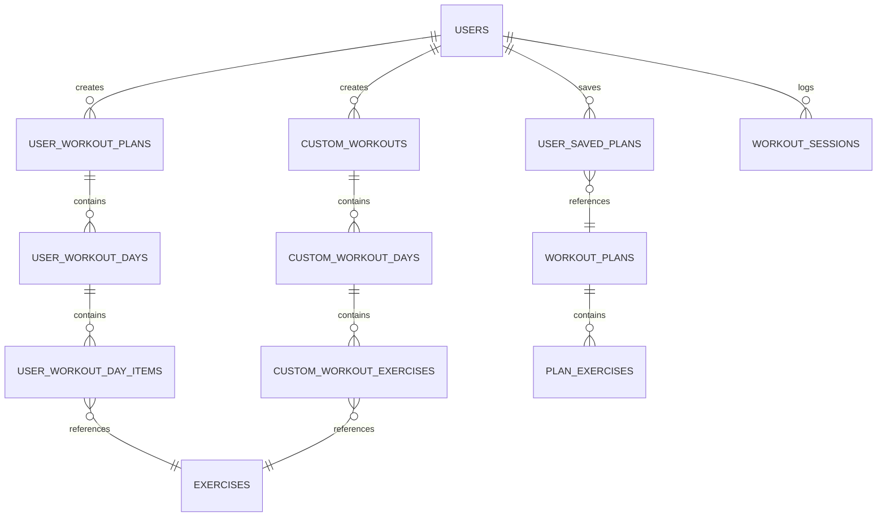
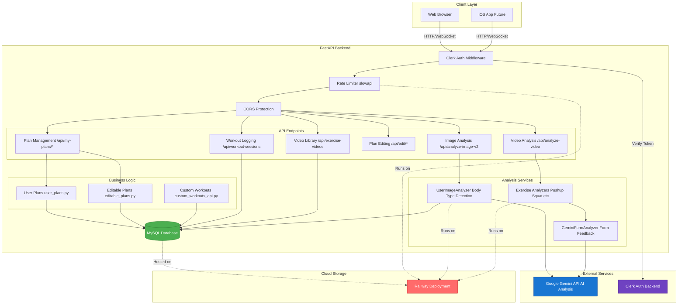
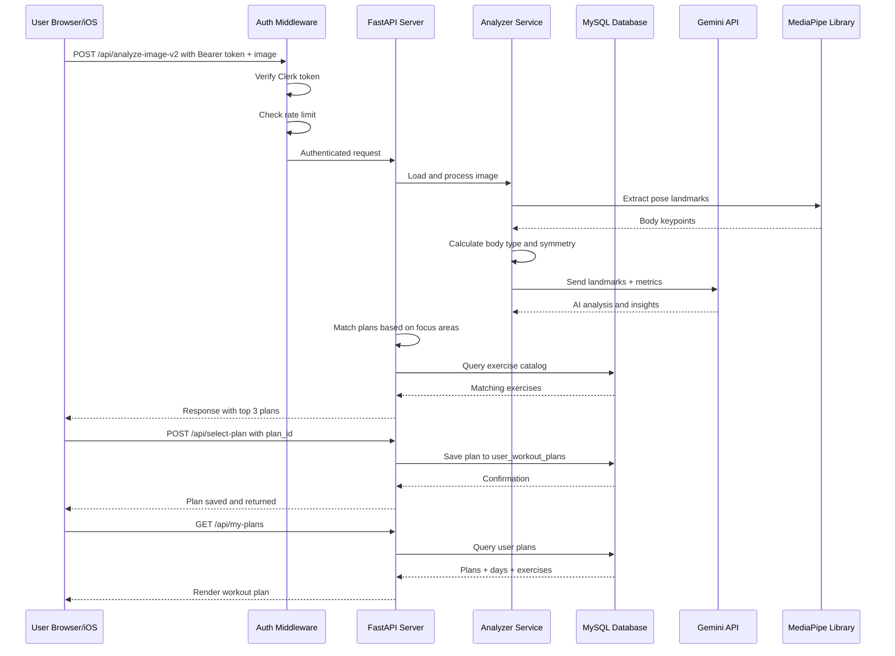

# Database Architecture & Service Connections

## Entity Relationship Diagram



## Service Connection Architecture



## Data Flow: Complete User Journey



## Table Schemas & Sample Data

### exercises
Central exercise library shared across all workouts.

| Column | Type | Notes |
|--------|------|-------|
| id | INT (PK) | Auto-increment |
| name | VARCHAR(100) | Exercise name |
| primary_muscle | VARCHAR(50) | Chest, back, shoulders, etc. |
| secondary_muscles | JSON | Array of secondary muscles |
| difficulty | ENUM | beginner, intermediate, advanced |
| equipment | VARCHAR(100) | barbell, dumbbell, machine, cables, bodyweight |
| beginner_reps | VARCHAR(20) | e.g., "10-15" |
| intermediate_reps | VARCHAR(20) | e.g., "6-12" |
| advanced_reps | VARCHAR(20) | e.g., "3-8" |
| sets_beginner | INT | Default sets for beginners |
| sets_intermediate | INT | Default sets for intermediate |
| sets_advanced | INT | Default sets for advanced |
| rest_seconds | INT | Rest between sets |
| instructions | TEXT | How to perform exercise |
| form_cues | TEXT | Form tips and warnings |
| created_at | TIMESTAMP | Auto-generated |

**Sample Row:**
```
id: 1
name: "Barbell Bench Press"
primary_muscle: "chest"
secondary_muscles: ["triceps", "shoulders"]
difficulty: "intermediate"
equipment: "barbell"
beginner_reps: "10-15"
intermediate_reps: "6-12"
advanced_reps: "3-8"
sets_beginner: 3
sets_intermediate: 3
sets_advanced: 4
rest_seconds: 90
instructions: "Lie flat on bench, grip shoulder-width, lower to chest, press up"
form_cues: "Keep elbows 45 degrees, full chest contact"
created_at: "2025-12-01 10:30:00"
```

---

### workout_plans
Pre-built workout programs in the app.

| Column | Type | Notes |
|--------|------|-------|
| id | INT (PK) | Auto-increment |
| name | VARCHAR(255) | Plan name |
| description | TEXT | Plan overview |
| body_type | ENUM | ectomorph, mesomorph, endomorph |
| primary_focus | VARCHAR(100) | chest, back, legs, etc. |
| difficulty | ENUM | beginner, intermediate, advanced |
| days_per_week | INT | 3, 4, 5, 6 days |
| created_at | TIMESTAMP | Auto-generated |

**Sample Row:**
```
id: 1
name: "Ectomorph - Chest (intermediate)"
description: "4-day split focused on chest development for lean body types"
body_type: "ectomorph"
primary_focus: "chest"
difficulty: "intermediate"
days_per_week: 4
created_at: "2025-01-01 00:00:00"
```

---

### plan_exercises
Links exercises to pre-built plans (which day, which exercise, sets/reps).

| Column | Type | Notes |
|--------|------|-------|
| id | INT (PK) | Auto-increment |
| plan_id | INT (FK) | References workout_plans |
| day_number | INT | 1-7 (which day of plan) |
| exercise_id | INT (FK) | References exercises |
| position | INT | Order in day (1st, 2nd, 3rd exercise) |
| sets | INT | Number of sets |
| reps | VARCHAR(50) | e.g., "6-12" |
| rest_seconds | INT | Rest between sets |
| notes | VARCHAR(255) | Optional notes |
| created_at | TIMESTAMP | Auto-generated |

**Sample Row:**
```
id: 1
plan_id: 1
day_number: 1
exercise_id: 1
position: 1
sets: 3
reps: "6-12"
rest_seconds: 90
notes: "Focus on form over weight"
created_at: "2025-01-01 00:00:00"
```

---

### user_saved_plans
When users click "Save Plan" on pre-built plans.

| Column | Type | Notes |
|--------|------|-------|
| id | INT (PK) | Auto-increment |
| clerk_user_id | VARCHAR(255) | User ID from Clerk auth |
| plan_id | INT (FK) | References workout_plans |
| body_type | VARCHAR(100) | Body type of user at save time |
| focus1, focus2, focus3 | VARCHAR(100) | Focus areas from image analysis |
| saved_at | TIMESTAMP | When saved |
| created_at | TIMESTAMP | Auto-generated |

**Sample Row:**
```
id: 1
clerk_user_id: "user_123abc456def"
plan_id: 1
body_type: "ectomorph"
focus1: "chest"
focus2: "shoulders"
focus3: "arm size"
saved_at: "2026-01-04 14:30:00"
created_at: "2026-01-04 14:30:00"
```

---

### user_workout_plans
AI-generated or user-created plans stored in editable format.

| Column | Type | Notes |
|--------|------|-------|
| id | INT (PK) | Auto-increment |
| clerk_user_id | VARCHAR(255) | User ID from Clerk auth |
| source_plan_id | INT (FK) | null if AI-generated, plan_id if copied |
| name | VARCHAR(255) | Plan name |
| days_per_week | INT | 3, 4, 5 days |
| primary_focus | VARCHAR(255) | Derived from body analysis |
| created_at | TIMESTAMP | Auto-generated |
| updated_at | TIMESTAMP | Auto-updated on changes |

**Sample Row:**
```
id: 5
clerk_user_id: "user_123abc456def"
source_plan_id: null
name: "AI-Generated Chest Focus Plan"
days_per_week: 4
primary_focus: "chest"
created_at: "2026-01-04 10:00:00"
updated_at: "2026-01-04 14:00:00"
```

---

### user_workout_days
Days within a user's editable plan.

| Column | Type | Notes |
|--------|------|-------|
| id | INT (PK) | Auto-increment |
| user_plan_id | INT (FK) | References user_workout_plans |
| day_number | INT | 1-7 |
| title | VARCHAR(255) | "Chest Day", "Leg Day", etc. |
| created_at | TIMESTAMP | Auto-generated |

**Sample Row:**
```
id: 12
user_plan_id: 5
day_number: 1
title: "Chest & Triceps"
created_at: "2026-01-04 10:00:00"
```

---

### user_workout_day_items
Individual exercises within a user's day.

| Column | Type | Notes |
|--------|------|-------|
| id | INT (PK) | Auto-increment |
| user_day_id | INT (FK) | References user_workout_days |
| exercise_id | INT (FK) | References exercises |
| sets | INT | User-configured sets |
| reps | VARCHAR(50) | User-configured reps |
| rest_seconds | INT | Rest time |
| position | INT | Order in workout |
| notes | VARCHAR(255) | User notes |
| created_at | TIMESTAMP | Auto-generated |

**Sample Row:**
```
id: 1001
user_day_id: 12
exercise_id: 1
sets: 4
reps: "6-10"
rest_seconds: 90
position: 1
notes: "Warmed up first"
created_at: "2026-01-04 10:00:00"
```

---

### custom_workouts
Fully custom workouts created by users.

| Column | Type | Notes |
|--------|------|-------|
| id | INT (PK) | Auto-increment |
| clerk_user_id | VARCHAR(255) | User ID |
| name | VARCHAR(255) | Workout name |
| description | TEXT | Optional description |
| days_per_week | INT | 3, 4, 5 days |
| difficulty | ENUM | beginner, intermediate, advanced |
| created_at | TIMESTAMP | Auto-generated |
| updated_at | TIMESTAMP | Auto-updated |

**Sample Row:**
```
id: 10
clerk_user_id: "user_123abc456def"
name: "My Push/Pull/Legs"
description: "Custom 3-day split"
days_per_week: 3
difficulty: "intermediate"
created_at: "2026-01-04 12:00:00"
updated_at: "2026-01-04 12:00:00"
```

---

### custom_workout_days
Days in custom workouts.

| Column | Type | Notes |
|--------|------|-------|
| id | INT (PK) | Auto-increment |
| custom_workout_id | INT (FK) | References custom_workouts |
| day_number | INT | 1-7 |
| title | VARCHAR(255) | Day name |
| created_at | TIMESTAMP | Auto-generated |

**Sample Row:**
```
id: 30
custom_workout_id: 10
day_number: 1
title: "Push Day"
created_at: "2026-01-04 12:00:00"
```

---

### custom_workout_exercises
Exercises in custom workout days.

| Column | Type | Notes |
|--------|------|-------|
| id | INT (PK) | Auto-increment |
| custom_day_id | INT (FK) | References custom_workout_days |
| exercise_id | INT (FK) | References exercises (can be null) |
| exercise_name | VARCHAR(255) | Exercise name (for custom exercises) |
| sets | INT | Sets to perform |
| reps | VARCHAR(50) | Reps per set |
| rest_seconds | INT | Rest time |
| notes | VARCHAR(255) | Optional notes |
| position | INT | Order in workout |
| created_at | TIMESTAMP | Auto-generated |

**Sample Row:**
```
id: 101
custom_day_id: 30
exercise_id: 1
exercise_name: "Barbell Bench Press"
sets: 4
reps: "6-8"
rest_seconds: 120
notes: "Heavy day"
position: 1
created_at: "2026-01-04 12:00:00"
```

---

---

### exercise_videos
Video library for exercise references and tutorials.

| Column | Type | Notes |
|--------|------|-------|
| id | INT (PK) | Auto-increment |
| exercise_id | INT (FK) | References exercises |
| video_url | VARCHAR(255) | URL to video |
| thumbnail_url | VARCHAR(255) | Thumbnail image URL |
| title | VARCHAR(255) | Video title |
| created_at | TIMESTAMP | Auto-generated |

**Sample Row:**
```
id: 1
exercise_id: 1
video_url: "https://example.com/barbell-bench-press.mp4"
thumbnail_url: "https://example.com/thumb.jpg"
title: "Barbell Bench Press - Form Guide"
created_at: "2025-12-01 10:30:00"
```

---

### workout_sessions
Logged workouts by users (performance history).

| Column | Type | Notes |
|--------|------|-------|
| id | INT (PK) | Auto-increment |
| clerk_user_id | VARCHAR(255) | User ID |
| day_id | INT (FK) | References user_workout_day |
| completed_at | TIMESTAMP | When workout was done |
| created_at | TIMESTAMP | Auto-generated |

**Sample Row:**
```
id: 1
clerk_user_id: "user_123abc456def"
day_id: 12
completed_at: "2026-01-04 18:30:00"
created_at: "2026-01-04 18:30:00"
```

---

### workout_session_exercises
Individual exercises logged in a workout session.

| Column | Type | Notes |
|--------|------|-------|
| id | INT (PK) | Auto-increment |
| session_id | INT (FK) | References workout_sessions |
| exercise_id | INT (FK) | References exercises |
| actual_sets | INT | Sets actually completed |
| actual_reps | INT | Reps actually completed |
| difficulty_rating | INT | 1-10 difficulty rating |
| notes | TEXT | User notes |
| created_at | TIMESTAMP | Auto-generated |

**Sample Row:**
```
id: 1
session_id: 1
exercise_id: 1
actual_sets: 4
actual_reps: 10
difficulty_rating: 7
notes: "Good form, could go heavier"
created_at: "2026-01-04 18:30:00"
```

---

### workout_progress
User progress tracking and statistics.

| Column | Type | Notes |
|--------|------|-------|
| id | INT (PK) | Auto-increment |
| clerk_user_id | VARCHAR(255) | User ID |
| total_workouts | INT | Total workouts completed |
| total_minutes | INT | Total minutes worked out |
| current_streak | INT | Current workout streak days |
| longest_streak | INT | Longest streak ever |
| last_workout | TIMESTAMP | Last workout date |
| updated_at | TIMESTAMP | Auto-updated |

**Sample Row:**
```
id: 1
clerk_user_id: "user_123abc456def"
total_workouts: 24
total_minutes: 1440
current_streak: 5
longest_streak: 12
last_workout: "2026-01-04 18:30:00"
updated_at: "2026-01-04 18:30:00"
```

---

### migrations
Schema version tracking (optional, for future migrations).

| Column | Type | Notes |
|--------|------|-------|
| version | INT (PK) | Migration version number |
| applied_at | TIMESTAMP | When migration was applied |

**Sample Row:**
```
version: 1
applied_at: "2025-12-01 00:00:00"
```
Performance optimization - caches matched plans by user profile hash.

| Column | Type | Notes |
|--------|------|-------|
| id | INT (PK) | Auto-increment |
| user_profile_hash | VARCHAR(255) (UNIQUE) | Hash of body type + focus |
| body_type | ENUM | User's body type |
| focus | VARCHAR(100) | Primary focus area |
| cached_plan | JSON | Full cached plan data |
| created_at | TIMESTAMP | When cached |
| expires_at | TIMESTAMP | Cache expiration |

**Sample Row:**
```
id: 1
user_profile_hash: "abc123def456..."
body_type: "ectomorph"
focus: "chest"
cached_plan: {
  "plan_id": 1,
  "name": "Ectomorph - Chest",
  "days": [...],
  "exercises": [...]
}
created_at: "2026-01-04 10:00:00"
expires_at: "2026-01-10 10:00:00"
```

---

## Common Query Patterns

### Find all exercises for a specific plan day
```sql
SELECT e.id, e.name, e.primary_muscle, uwdi.sets, uwdi.reps, uwdi.rest_seconds
FROM user_workout_day_items uwdi
JOIN exercises e ON uwdi.exercise_id = e.id
WHERE uwdi.user_day_id = 12
ORDER BY uwdi.position ASC;
```

**Result:**
```
| id | name | primary_muscle | sets | reps | rest_seconds |
|----|------|----------------|------|------|--------------|
| 1 | Barbell Bench Press | chest | 4 | 6-10 | 90 |
| 5 | Push-ups | chest | 3 | 8-12 | 60 |
| 17 | Cable Flyes | chest | 3 | 10-15 | 60 |
```

---

### Get a user's all plans (saved + AI-generated + custom)
```sql
SELECT 'saved' as type, id, name as name, days_per_week, created_at 
FROM user_saved_plans 
WHERE clerk_user_id = 'user_123abc456def'
UNION ALL
SELECT 'ai-generated', id, name, days_per_week, created_at 
FROM user_workout_plans 
WHERE clerk_user_id = 'user_123abc456def'
UNION ALL
SELECT 'custom', id, name, days_per_week, created_at 
FROM custom_workouts 
WHERE clerk_user_id = 'user_123abc456def'
ORDER BY created_at DESC;
```

**Result:**
```
| type | id | name | days_per_week | created_at |
|------|----|----|---------------|-----------|
| ai-generated | 5 | AI-Generated Chest Focus | 4 | 2026-01-04 10:00 |
| saved | 1 | Ectomorph - Chest | 4 | 2026-01-03 09:00 |
| custom | 10 | My Push/Pull/Legs | 3 | 2026-01-02 14:00 |
```

---

### Get full plan structure with all exercises
```sql
SELECT 
  uwd.day_number,
  uwd.title,
  e.id,
  e.name,
  e.primary_muscle,
  uwdi.sets,
  uwdi.reps,
  uwdi.position
FROM user_workout_days uwd
LEFT JOIN user_workout_day_items uwdi ON uwd.id = uwdi.user_day_id
LEFT JOIN exercises e ON uwdi.exercise_id = e.id
WHERE uwd.user_plan_id = 5
ORDER BY uwd.day_number, uwdi.position;
```

**Result:**
```
| day_number | title | id | name | primary_muscle | sets | reps | position |
|----------|-------|----|----|----------------|------|------|----------|
| 1 | Chest & Triceps | 1 | Barbell Bench Press | chest | 4 | 6-10 | 1 |
| 1 | Chest & Triceps | 17 | Cable Flyes | chest | 3 | 10-15 | 2 |
| 1 | Chest & Triceps | 23 | Cable Pushdowns | triceps | 3 | 10-12 | 3 |
| 2 | Back & Biceps | 9 | Barbell Rows | back | 4 | 6-10 | 1 |
| 2 | Back & Biceps | 11 | Pull-ups | back | 3 | 6-10 | 2 |
```

---

### Find all exercises by muscle group
```sql
SELECT DISTINCT name, difficulty, equipment, primary_muscle
FROM exercises
WHERE primary_muscle = 'chest'
ORDER BY difficulty, name;
```

**Result:**
```
| name | difficulty | equipment | primary_muscle |
|------|-----------|-----------|----------------|
| Machine Chest Press | beginner | machine | chest |
| Push-ups | beginner | bodyweight | chest |
| Dumbbell Bench Press | beginner | dumbbell | chest |
| Barbell Bench Press | intermediate | barbell | chest |
| Incline Dumbbell Press | intermediate | dumbbell | chest |
| Cable Flyes | intermediate | cables | chest |
| Barbell Bench Press | advanced | barbell | chest |
```

---

## Complete Data Flow Example

### Scenario: User uploads an image, gets plan recommendations, saves a plan

**Step 1: Image Upload & Analysis**
- User uploads image → API receives request
- UserImageAnalyzer extracts MediaPipe landmarks
- Calculates body_type = "ectomorph"
- Detects focus_areas = ["chest", "shoulders", "arm size"]
- Sends to Gemini API for detailed analysis

**Step 2: Plan Matching**
```sql
-- Query for plans matching user's profile
SELECT wp.id, wp.name, wp.days_per_week
FROM workout_plans wp
WHERE wp.body_type = 'ectomorph'
  AND wp.primary_focus IN ('chest', 'shoulders')
ORDER BY RAND()
LIMIT 3;
```

Returns to user: Top 3 matched plans

**Step 3: User Selects Plan**
```sql
-- Insert into user_saved_plans
INSERT INTO user_saved_plans 
(clerk_user_id, plan_id, body_type, focus1, focus2, focus3)
VALUES 
('user_123abc456def', 1, 'ectomorph', 'chest', 'shoulders', 'arm size');
```

Result: Plan now appears in user's "My Plans"

**Step 4: User Views Plan**
```sql
-- Get all days and exercises in plan
SELECT *
FROM plan_exercises pe
JOIN exercises e ON pe.exercise_id = e.id
WHERE pe.plan_id = 1
ORDER BY pe.day_number, pe.position;
```

Returns structured workout plan to display

**Step 5: User Edits Plan** (Optional)
```sql
-- Create editable copy of saved plan
INSERT INTO user_workout_plans 
(clerk_user_id, source_plan_id, name, days_per_week, primary_focus)
VALUES 
('user_123abc456def', 1, 'My Modified Chest Plan', 4, 'chest');

-- Create days for editable plan
INSERT INTO user_workout_days (user_plan_id, day_number, title)
VALUES (5, 1, 'Chest & Triceps');

-- Add exercises to day
INSERT INTO user_workout_day_items 
(user_day_id, exercise_id, sets, reps, rest_seconds, position)
VALUES (12, 1, 4, '6-10', 90, 1);
```

**Step 6: User Logs Workout**
```sql
-- User completes day 1 workout
INSERT INTO workout_sessions 
(clerk_user_id, day_id, completed_at)
VALUES 
('user_123abc456def', 12, '2026-01-04 18:30:00');

-- Log individual exercises from the workout
INSERT INTO workout_session_exercises
(session_id, exercise_id, actual_sets, actual_reps, difficulty_rating)
VALUES 
(1, 1, 4, 10, 7);
```

Saves performance data to workout_sessions and workout_session_exercises for progress tracking

---

## Index Strategy for Performance

Indexes optimize common queries:

```sql
-- Exercise lookups (by muscle group, difficulty)
KEY idx_primary_muscle (primary_muscle)
KEY idx_difficulty (difficulty)
UNIQUE KEY idx_name_difficulty (name, difficulty)

-- User-specific queries
INDEX idx_uwp_user (clerk_user_id)
INDEX idx_uwd_plan (user_plan_id)
INDEX idx_uwdi_day (user_day_id)

-- Plan structure traversal
INDEX idx_plan (plan_id)
INDEX idx_exercise (exercise_id)

-- Caching
KEY idx_profile_hash (user_profile_hash)

-- History queries
INDEX idx_created (created_at)
```

These indexes ensure:
- Fast user data isolation (all queries filter by clerk_user_id)
- Quick plan structure traversal (day → exercises)
- Rapid exercise catalog searches (by muscle, difficulty)
- Cache lookups (by user profile hash)

## Service Dependencies

```
main.py (FastAPI App)
├── clerk_auth.py ─────────► Clerk API (Auth verification)
├── db.py ──────────────────► MySQL Database
├── user_plans.py ──────────► db.py
├── editable_plans.py ──────► db.py
├── custom_workouts_api.py ► db.py
├── video_library_api.py ───► db.py
├── workout_logging_api.py ► db.py
│
└── analyzers/
    ├── base_analyzer.py ───► Base class
    ├── user_image_analyzer.py
    │   ├─► MediaPipe (Pose detection)
    │   ├─► Gemini API (AI analysis)
    │   └─► db.py (Save body type data)
    │
    ├── pushup_analyzer.py ─► OpenCV, MediaPipe
    ├── squat_analyzer.py ──► OpenCV, MediaPipe
    ├── shoulder_press_analyzer.py ─► OpenCV, MediaPipe
    │
    └── gemini_form_analyzer.py
        ├─► OpenCV (Frame extraction)
        ├─► MediaPipe (Pose detection)
        └─► Gemini API (Form feedback)
```

## Rate Limiting by Endpoint

| Endpoint | Limit | Purpose |
|----------|-------|---------|
| `/api/analyze-image-v2` | 5/min | Prevent API abuse on image processing |
| `/api/analyze-video` | 5/min | Expensive video processing |
| `/api/select-plan` | 30/min | Plan selection requests |
| `/api/my-plans` (GET) | 60/min | Fetching plans (read-only) |
| `/api/my-plans/{id}` (DELETE) | 30/min | Destructive operation |
| `/api/edit/days/{id}/items` (POST) | 60/min | Plan editing |
| `/api/edit/items/{id}` (DELETE) | 60/min | Item deletion |

Rate limits are **per-user** (hashed Bearer token) with **IP fallback** for unauthenticated requests.
