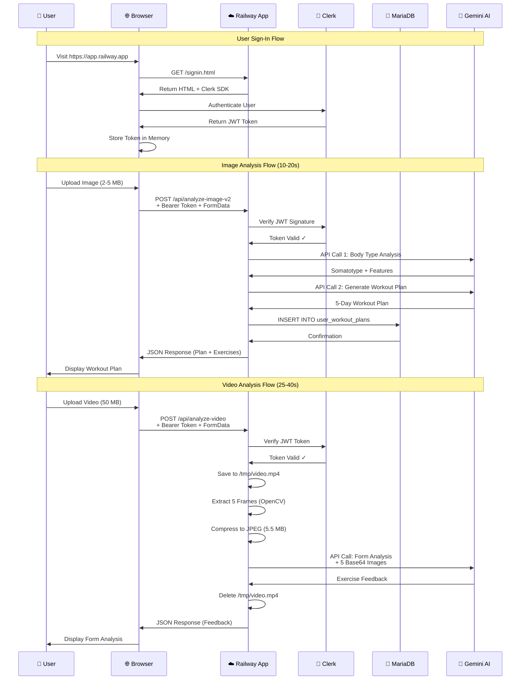
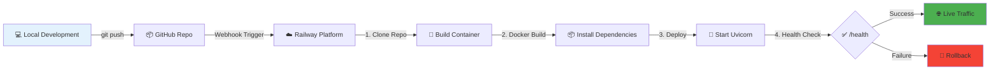

# SculpFit Deployment Architecture

## System Deployment Diagram

```mermaid
graph TB
    subgraph "Client Layer"
        User[👤 User Browser]
    end
    
    subgraph "Railway Platform"
        subgraph "Docker Container"
            subgraph "FastAPI Application"
                Uvicorn[Uvicorn Server<br/>:8000]
                Static[Static Files<br/>HTML/CSS/JS]
                API[REST API Endpoints<br/>main.py]
                Auth[Clerk Auth<br/>clerk_auth.py]
                
                subgraph "Business Logic"
                    UserPlans[User Plans<br/>user_plans.py]
                    CustomWO[Custom Workouts<br/>custom_workouts_api.py]
                    VideoLib[Video Library<br/>video_library_api.py]
                    WorkoutLog[Workout Logging<br/>workout_logging_api.py]
                    EditPlans[Editable Plans<br/>editable_plans.py]
                end
                
                subgraph "AI Analyzers"
                    ImageAI[Image Analyzer<br/>user_image_analyzer.py]
                    VideoAI[Video Analyzer<br/>gemini_form_analyzer.py]
                    FormAI[Form Analyzer<br/>Base Classes]
                end
                
                DB_Conn[Database Connection<br/>db.py]
            end
            
            TempStorage[/tmp/<br/>Temporary Video Files]
        end
        
        Database[(MariaDB 10.11<br/>Railway MySQL)]
    end
    
    subgraph "External Services"
        Clerk[🔐 Clerk Auth<br/>JWT Verification<br/>clerk.com]
        Gemini[🤖 Google Gemini AI<br/>gemini-2.5-flash<br/>generativelanguage.googleapis.com]
    end
    
    subgraph "GitHub"
        Repo[📦 Source Repository<br/>github.com/moazanTUS/sculptfitt]
    end
    
    %% User Interactions
    User -->|HTTPS Requests| Uvicorn
    Uvicorn -->|Serve Static Files| Static
    Static -->|SPA Navigation| User
    
    %% API Flow
    User -->|API Calls + JWT Token| API
    API -->|Verify Token| Auth
    Auth -->|Validate JWT| Clerk
    
    %% Business Logic
    API --> UserPlans
    API --> CustomWO
    API --> VideoLib
    API --> WorkoutLog
    API --> EditPlans
    
    %% AI Processing
    API -->|Image Analysis| ImageAI
    API -->|Video Analysis| VideoAI
    ImageAI -->|2 API Calls| Gemini
    VideoAI -->|Frame Extraction| TempStorage
    VideoAI -->|1 API Call| Gemini
    
    %% Database
    UserPlans --> DB_Conn
    CustomWO --> DB_Conn
    VideoLib --> DB_Conn
    WorkoutLog --> DB_Conn
    EditPlans --> DB_Conn
    DB_Conn -->|SQL Queries| Database
    
    %% Deployment
    Repo -->|Auto Deploy| Uvicorn
    
    style User fill:#e1f5ff
    style Uvicorn fill:#ff9800
    style Database fill:#4caf50
    style Clerk fill:#6c5ce7
    style Gemini fill:#00bcd4
    style Repo fill:#333
    style TempStorage fill:#ffd54f
```

## Network Flow Diagram



## Infrastructure Components

### 1. **Railway Platform** (PaaS)
- **Service Type**: Docker Container
- **Region**: Auto-selected by Railway
- **Auto-Scaling**: Single instance (no horizontal scaling)
- **Build**: Dockerfile-based
- **Health Check**: `/health` endpoint (30s timeout)
- **Port**: Dynamic `$PORT` or fallback 8000

### 2. **Docker Container**
```
Base Image: python:3.11-slim
Dependencies:
  - FFmpeg (video processing)
  - OpenCV libraries (libgl1, libglib2.0-0, libsm6, libxext6)
  - Python packages (requirements.txt)
  
Runtime:
  - Uvicorn ASGI server (single worker)
  - No multi-processing or load balancing
  - Serves both API and static files
```

### 3. **Database: MariaDB 10.11**
```
Host: Railway-managed MySQL
Port: 3306
Persistence: Railway volume storage
Tables: 15 (exercises, workout_plans, user_saved_plans, etc.)
Connection: PyMySQL driver
```

### 4. **External Services**

#### Clerk Authentication
- **Purpose**: JWT token generation & verification
- **Protocol**: RS256 asymmetric encryption
- **Endpoint**: `https://api.clerk.com/.well-known/jwks.json`
- **Integration**: Bearer token in Authorization header

#### Google Gemini AI
- **Model**: gemini-2.5-flash
- **Endpoint**: `https://generativelanguage.googleapis.com/v1beta/models/gemini-2.5-flash:generateContent`
- **Usage**:
  - Image analysis: 2 API calls per request
  - Video analysis: 1 API call per request
- **Input**: Text prompts + Base64 images
- **Output**: JSON-structured responses

## Environment Configuration

### Required Environment Variables
```bash
# Database (Railway auto-populates if using Railway MySQL)
DB_HOST=containers-us-west-xxx.railway.app
DB_PORT=3306
DB_USER=root
DB_PASS=****************
DB_NAME=sculpfit

# API Keys
GEMINI_API_KEY=AIza****************
CLERK_SECRET_KEY=sk_live_****************

# CORS Configuration
ALLOWED_ORIGINS=https://sculpt-production.up.railway.app,https://www.sculptfit.com

# Server (Railway auto-sets)
PORT=8000
```

### Security Features
- ✅ No secrets in code (environment variables only)
- ✅ JWT signature verification on all protected endpoints
- ✅ CORS restricted to specific domains (not `*`)
- ✅ Rate limiting: 5 req/min (AI), 30 req/min (plans), 60 req/min (reads)
- ✅ No file persistence (temp files deleted after processing)

## Deployment Workflow



### Deployment Steps
1. **Push to GitHub**: `git push origin main`
2. **Railway Auto-Build**: Detects Dockerfile, builds image
3. **Health Check**: Railway pings `/health` endpoint
4. **Traffic Routing**: New deployment receives traffic
5. **Zero Downtime**: Railway keeps old container until new one passes health check

## Resource Utilization

### CPU & Memory
- **Baseline**: ~100 MB RAM (idle)
- **Image Analysis**: +2.5 MB RAM, ~2-5s CPU burst
- **Video Analysis**: +85 MB RAM (peak), ~10-15s CPU burst
- **Concurrent Users**: Limited by single Uvicorn worker

### Storage
- **Container Size**: ~1.2 GB (includes OpenCV, FFmpeg)
- **Temporary Files**: `/tmp` (cleared on restart)
- **No Persistent Storage**: All media processed in-memory or temp files

### Network
- **Inbound**: User uploads (50 MB max per video)
- **Outbound**: API responses (JSON), Gemini API calls
- **External Calls**:
  - Clerk JWKS: ~1 KB per token verification
  - Gemini API: 5.5 MB per video analysis, ~500 KB per image

## Monitoring & Health

### Health Check Endpoint
```python
@app.get("/health")
async def health_check():
    return {"status": "healthy", "timestamp": datetime.utcnow()}
```

### Logs
- **Railway Dashboard**: Real-time log streaming
- **Uvicorn Access Logs**: HTTP request logs
- **Python Logging**: Application-level logs

## Scaling Considerations

### Current Limitations (Monolithic)
- ❌ Single process (no horizontal scaling)
- ❌ No load balancing
- ❌ No request queuing
- ❌ Shared resource pool (CPU/RAM)

### Future Microservices Architecture
```
┌─────────────────┐
│  API Gateway    │ ← Entry point
└────────┬────────┘
         │
    ┌────┴────┬─────────┬──────────┐
    │         │         │          │
┌───▼──┐  ┌──▼──┐  ┌──▼───┐  ┌───▼────┐
│ Auth │  │Plans│  │Image │  │ Video  │
│Service│ │API  │  │ AI   │  │ AI     │
└──────┘  └─────┘  └──────┘  └────────┘
```

## Cost Breakdown (Estimated)

### Railway Platform
- Free Tier: $5 credit/month (500 hours)
- Hobby Plan: $5/month (500 hours + better support)
- Pro Plan: $20/month (unlimited hours + teams)

### External Services
- **Clerk**: Free tier (10,000 MAU)
- **Google Gemini**: Free tier (60 requests/min)
- **Database**: Included in Railway plan

### Monthly Estimate (Low Traffic)
- Railway: $5/month (Hobby)
- Clerk: $0 (under 10k users)
- Gemini: $0 (under rate limits)
- **Total**: ~$5/month

## Backup & Recovery

### Database Backup
- Railway automatic backups (Pro plan)
- Manual: `mysqldump` via Railway CLI

### Code Backup
- GitHub repository (version control)
- Railway keeps previous deployments (rollback available)

### Disaster Recovery
1. Database: Restore from Railway backup
2. Application: Redeploy from GitHub
3. Environment Variables: Re-enter in Railway dashboard

## Performance Benchmarks

| Operation | Avg Time | Peak RAM | Network |
|-----------|----------|----------|---------|
| Page Load | <1s | 100 MB | 200 KB |
| Image Analysis | 10-20s | 102.5 MB | 2-5 MB ↑ + 500 KB ↓ |
| Video Analysis | 25-40s | 185 MB | 50 MB ↑ + 5.5 MB (Gemini) |
| Database Query | 50-200ms | +5 MB | <10 KB |
| Auth Verification | 100-300ms | +1 MB | 1 KB |

---

**Last Updated**: January 28, 2026  
**Deployment URL**: https://sculpt-production.up.railway.app  
**Repository**: https://github.com/moazanTUS/sculptfitt
